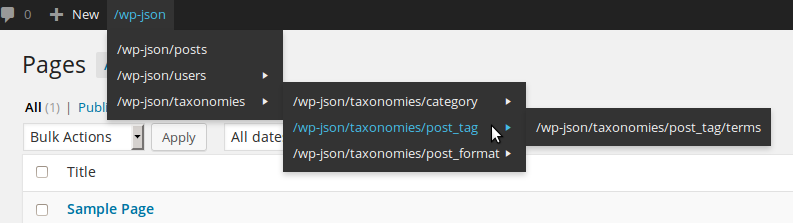

# REST endpoints to admin bar

A WordPress plugin which links all relevant API endpoints to the admin bar. It further generates valid nonces
so that one can view endpoints like `/wp-json/users/` directly from the browser if you're logged in.

**The plugin requires PHP 5.4!**

## Why
Developing with a REST API often needs you to visualize the data structure. I found the easiest way for me to do
that directly in the browser using a JSON formatter like [JSONView (for Firefox)](http://jsonview.com/). While it
is no problem to queue for public data like `/wp-json/posts` or `/wp-json/taxonomies/category/terms` one need a
valid nonce to avoid CSRF-attacks when queuing sensitive data like `/wp-json/users`. That is what the plugin does:
it provide links with valid nonces as request parameter.

## Known issues

[#2](./issues/2), [#1](./issues/1)